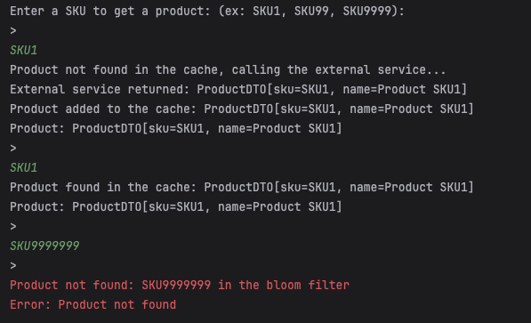

# POC: Proteção de Carga em API de Produto com Bloom Filter + Cache

## Objetivo:

- Simular requisições para busca de produtos por SKU.
- Utilizar **_Bloom Filter_** para filtrar requisições inválidas de forma eficiente.
- Utilizar **_cache em memória_** para acelerar a resposta de produtos já consultados.
- Acessar um **_mock de serviço externo_** apenas em caso de cache miss, protegendo a aplicação externa de sobrecarga.

---

## Resultado:

1. Uma requisição é feita com o input SKU1.
2. O Bloom Filter é consultado:
   - Como SKU1 foi previamente adicionado no Bloom Filter, o fluxo prossegue.
3. O cache em memória é consultado:
   - Como ainda não existe um cache para SKU1, a aplicação consulta o serviço externo mockado.
4. O serviço externo retorna o produto e o mesmo é armazenado no cache.
5. A partir da próxima requisição para SKU1, a resposta é servida diretamente do cache, reduzindo latência e evitando nova consulta externa.
6. Quando uma requisição é feita com um SKU inexistente no Bloom Filter (exemplo: SKU9999999):
   - O sistema detecta imediatamente que o SKU é inválido e retorna um erro de "Product not found", sem acessar o cache ou o serviço externo.

---
## Execução:

---

## Benefícios simulados

- Redução de carga em sistemas externos.
- Resposta rápida para SKUs inexistentes (filtro direto).
- Otimização de performance para produtos populares (via cache).
- Simulação realista de um ambiente de alta escala com proteção de backend.