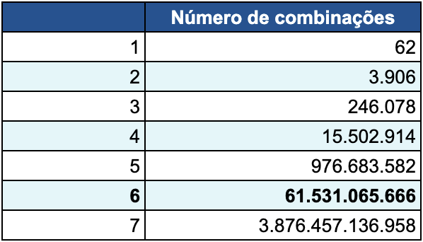

# [POC] Encurtador de URL com Bloom Filter para evitar colisão

#### Autor: Vitor Moschetti
#### Proposta: Utilizar a estrutura Bloom Filter para evitar colisão de dados em um sistema de encurtar URLs.

## Arquitetura da solução:

#### Cenário:

URLs longas são mais difíceis de lembrar, manter e compartilhar. O encurtamento de URL é uma técnica, adotada frequentemente, 
para transformar endereços HTTP em links mais curtos.

As principais features do serviço, segundo descrito pelas pessoas do negócio, são:

1. Encurtar URLs; ou seja, fornecida uma URL longa pelo usuário, gerar uma URL muito menor.
2. Redirecionamento rápido; ou seja, acessada uma URL encurtada, gerada pela plataforma, redirecionar o usuário para a URL original

NÃO há expectativa de gerar estatísticas, permitir alteração ou exclusão de URLs inseridas na plataforma, 
tampouco permitir customização das URLs geradas.

O formato da URL encurtada deverá ser `www.abc.com/<id>`. 
Sendo que a parte id deve ser uma cadeia o mais curta possível compostas por números (0-9) e letras (a-z, A-Z).

#### Endpoints

Parece ser adequado desenvolver o serviço como uma API REST. Destacam-se dois endpoints principais.

1. Encurtamento de URL com POST `www.abc.com/shorten?url=<long-url>`
2. Redirecionamento com GET `www.abc.com/<short-url>`

#### Redirecionamentos

Status code 301 – indicando que o recurso endereçado pela URL solicitada foi movido permanentemente para um novo endereço;

Retornar 301 é, de longe, a forma mais econômica de implementar o redirecionamento, afinal, 
evitará que os servidores do serviço sejam acionados desnecessariamente, 
uma vez que o browser cliente deverá promover o redirecionamento sozinho.

#### Tamanho da chave para URLs encurtadas

Para o exercício e cenário de estudo, o tamanho da chave será de 2 caracteres, logo, o limite máximo seria de 3906 combinações.
Sendo assim, veremos facilmente a atuação do Bloom Filter para evitar colisões de chaves na base.

#### Estratégia para geração da chave

Sabendo-se o tamanho adequado da chave é interessante determinar qual seria a estratégia para geração da chave.

Uma primeira abordagem possível seria utilizar algum algoritmo de hashing como CRC32 ou MD5. 
O problema é que ambos geram saídas com mais de 2 caracteres (CRC32 tem 8 caracteres e MD5 tem 32 caracteres), 
demandando alguma estratégia de corte.

Além disso, há riscos de colisões. Ou seja, duas URLs gerando chaves idênticas (risco significativamente ampliado com a necessidade de corte). 
Na prática, o uso de hashing implica em “idas e voltas” ao banco para detectar chaves já utilizadas em consultas potencialmente onerosas, 
eventualmente minimizadas pela adoção de técnicas como Bloom Filters.

#### Bloom Filter

Um Bloom Filter é uma estrutura de dados probabilística, que demanda pouquíssimo espaço, concebida por Burton Howard Bloom em 1970. 
Ela é utilizada para testar se um elemento está presente em um conjunto sem necessitar consultar a lista completa de elementos presente nesse conjunto.

Eventualmente, a estrutura pode apontar um falso positivo (indicando que um elemento está em um conjunto quando, na verdade, não está). 
Entretanto, jamais gera um falso negativo.

Quanto mais elementos são adicionados a uma Bloom Filter, maiores são as chances de um falso positivo.

#### Fonte do estudo: https://arquiteturadesoftware.online/volume-1/iniciando-o-design-arquitetural-de-um-encurtador-de-urls/